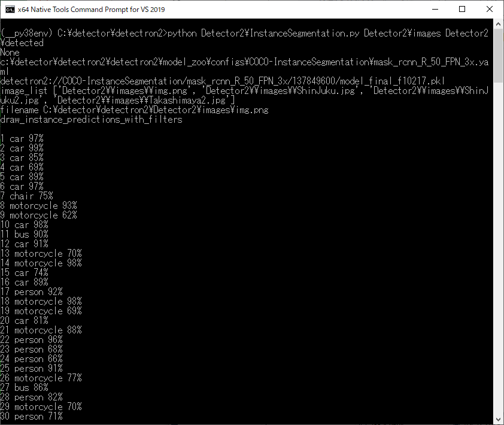

<html>
<body>
<h1>Detector2</h1>
<b>
This is a simple python class Detector2 based on DefaultDetector class of detectron2. 
</b>
 
<h2>1 Installation </h2>
<h3>
1.1 detectron2
</h3>

 We have downloaded <a href="https://github.com/facebookresearch/detectron2">detectron2</a>.
and installed pytorch-cpu and tochvision-cpu in the following way. 

 
<table style="border: 1px solid red;">
<tr><td>

git clone https://github.com/facebookresearch/detectron2.git 
cd detectron2 

In Windows10, please comment out line 187 of setup.py in that directory  
to avoid a compilation error, not to buid "pycocotools". We will build it manually later. 

python setup.py build develop 
pip install torch==1.5.0+cpu torchvision==0.6.0+cpu -f https://download.pytorch.org/whl/torch_stable.html 
pip install Cython 
pip install git+https://github.com/facebookresearch/fvcore 
pip install opencv-python==4.3.0 
pip install PyYAML==5.3.1 
pip install requests==2.24.0 
pip install requests-oauthlib==1.3.0 

</td></tr>
</table>

<h3>
1.2 cocoapi
</h3>
Please change directory to the detectron2 folder, and clone cocoapi.git in the following way.
<pre>
detectron2>git clone https://github.com/cocodataset/cocoapi.git
</pre>

Modify cocoeval.cpp file. 
<pre>
cocoeval.cpp  
//2020/08/5 localtime_r(&rawtime, &local_time); No localtime_r in vs2019
  localtime_s(&rawtime, &local_time);
</pre>

1.3 Modify setup.py
</h3>
Please modify extra_compile_args in detectron2\cocoapi\PythonAPI\setup.py file in the following way. 
<pre>
ext_modules = [
    Extension(
        'pycocotools._mask',
        sources=['../common/maskApi.c', 'pycocotools/_mask.pyx'],
        include_dirs = [np.get_include(), '../common'],
        #2020/07/05 extra_compile_args=['-Wno-cpp', '-Wno-unused-function', '-std=c99'],
        extra_compile_args=[],
    )
]
</pre>

<h3>
1.4 Run the following command.
</h3>

detectron2\cocoapi\PythonAPI>python setup.py build_ext install

 
Please clone <a href="https://github.com/atlan-antillia/Detector2.git">https://github.com/atlan-antillia/Detector2.git</a> in a 
folder under the detectron2 folder made by git-cloning the detetron2.
<pre>
detectron2>git clone  https://github.com/atlan-antillia/Detector2.git
</pre>

<h2>2 Detector2 class</h2>
 We have defined Detector2 class and added some new additional classes in this super tiny project. 
 
<a href="./Detector2.py">Detector2</a>  

<a href="./DetectronModelZoo.py">DetectronModelZoo</a> 
&nbsp;&nbsp;&nbsp;&nbsp;<a href="./CocoInstanceSegmentation.py">CocoInstanceSegmentation</a>  
&nbsp;&nbsp;&nbsp;&nbsp;<a href="./CocoPanopticSegmentation.py">CocoPanopticSegmentation</a>  
<a href="./FilteredVisualizer.py">FilteredVisualizer</a> 
<a href="./FiltersParser.py">FiltersParser</a> 

 

<h2>3 Sample programs</h2>
<h3>
3.1 InstanceSegmentation.py
</h3>
Please run the following command in the format: 
<pre>
detectron2>python Detector2\InstanceSegmentation.py input_image_file  output_image_dir [optional_filters]
</pre>
 
 In instanceSegmentation, the above command will save the detected objects information as a csv file in the following format. 
<pre>
id, class,      score, x,   y, width, height
--------------------------------------------
1,  car,         90%, 1305, 612, 326, 281
2,  car,         87%, 1245, 896, 336, 183
3,  car,         85%, 1569, 643, 328, 261
4,  car,         84%, 211,  631, 261, 203
5,  car,         84%, 1024, 376,  91,  93
6,  car,         83%, 1173, 481, 140, 127
7,  motorcycle,  81%, 1230, 747,  89, 122
8,  car,         81%, 486,  871, 293, 205
9,  car,         81%, 1107, 327,  69,  54
10,  person,     79%, 1094, 472,  40,  72
11,  motorcycle, 78%, 1082, 717,  73, 125
12,  person,     77%, 813,  593,  54, 108
</pre>
Furthermore, the number of objects in each class (objects_stats) on the detected objects as csv below. 
<pre>
id class     count
-------------------
1, car,        24
2, motorcycle, 16
3, person,     52
4, bus,         2
</pre>
 

Example: filters=[person,car]
<pre>
detectron2>python Detector2\InstanceSegmentation.py Detector2\images\img.png Detector2\detected [person,car]
</pre>
In this case, the <i>car</i> objects only will be selected as shown below. 
  

 
instance_seg_person_car_img.png.csv 

 
 
instance_seg_person_car_img.png_stats.csv 

 
 

<h3>
3.2 PanopticSegmentation.py
</h3>
Please run the following command in the format: 
<pre>
detectron2>python Detector2\PanopticSegmentation.py input_image_file  output_image_dir
</pre>
Example:
<pre>
detectron2>python Detector2\PanoticSegmentation.py Detector2\images\img.png Detector2\detected 
</pre>

 
 
<h3>
4 Batch Segmentation
</h3>
You can run the following command to apply a segmentation-process for each image file in an images directory. 

<pre>
detectron2>python Detector2\InstanceSegmentation.py input_image_dir output_image_dir 
</pre> 

Example:
<pre>
detectron2>python Detector2\InstanceSegmentation.py Detector2\images Detector2\detected 
</pre> 

 
<h2>
Citing Detectron2
</h2>
If you use Detectron2 in your research or wish to refer to the baseline results published in the Model Zoo, please use the following BibTeX entry.
<pre>
@misc{wu2019detectron2,
  author =       {Yuxin Wu and Alexander Kirillov and Francisco Massa and
                  Wan-Yen Lo and Ross Girshick},
  title =        {Detectron2},
  howpublished = {\url{https://github.com/facebookresearch/detectron2}},
  year =         {2019}
}
</pre>
</body>
</html>

